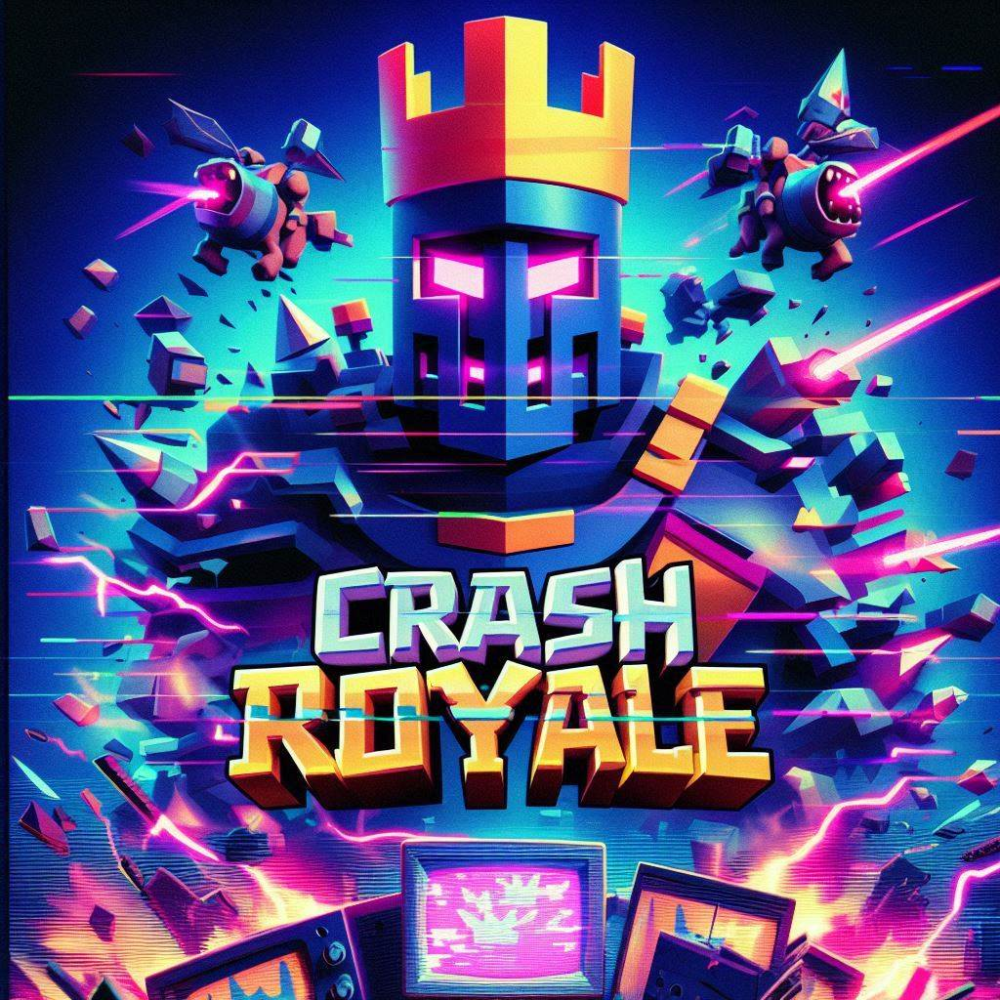

# Crash Royale with GDX2D
<p align="center">
  
</p>

## Description du Projet

Ce projet est une implémentation du jeu "Crash Royale", une reproduction du jeu "Clash Royale", utilisant le framework GDX2D. Le but de ce projet est de mettre en pratique les connaissances acquises en programmation orientée-objet et en structures de données dynamiques.

## Fonctionnalités

- Gestion de l'affichage graphique et des entités en temps réel.
- Système de déploiement des différentes entités.
- Pathfinding avec l'algorithme A*.
- Combat 1V1.

## Vidéo de Démonstration

[Voir la démonstration](./data/images/CrashRoyaleVideo.mp4)


## Structure du Code

Le code est organisé en plusieurs fichiers et classes pour assurer une bonne flexibilité. Voici une brève description des principaux composants :

### Classes Principales

- `GameWindow` : Gère la fenêtre de jeu et le rendu graphique.
- `Player` : Représente un joueur et gère ses unités et bâtiments.
- `Entity` : Classe abstraite représentant une entité du jeu (minion ou bâtiment).
- `Minion` : Classe dérivée de `Entity` représentant une unité déployable.
- `Building` : Classe dérivée de `Entity` représentant un bâtiment.

## Installation

Pour cloner et exécuter ce projet, vous aurez besoin de [Git](https://git-scm.com) et de [SBT](https://www.scala-sbt.org) installés sur votre machine.

### Cloner le dépôt

```bash
git clone https://github.com/votre_nom_utilisateur/clash-royale-scala.git
cd clash-royale-scala
```

<p align="right">
  
</p>
